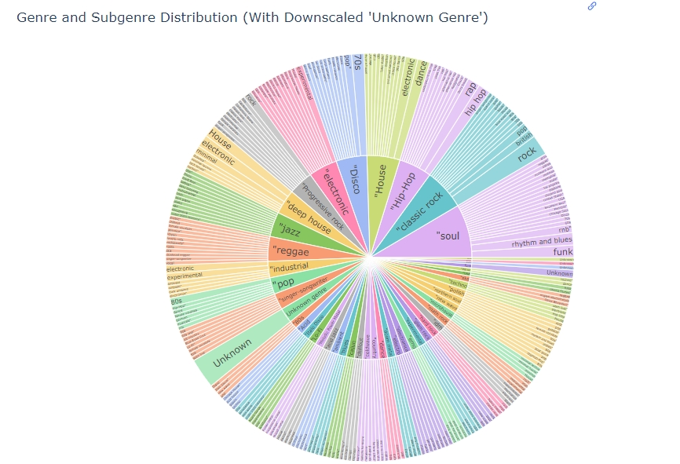

# WebScrap_ETL

Simple ETL project to scrap Tracks from Radio Show, Update Genres from audioscrobbler, save to sqllight db and visualize genres per show with quarto.

The idea is to have latest show presented as genre distribution figure.

GitHub Pages link: https://kikkomanq.github.io/WebScrap_ETL/doYouu_oct_plot.html

